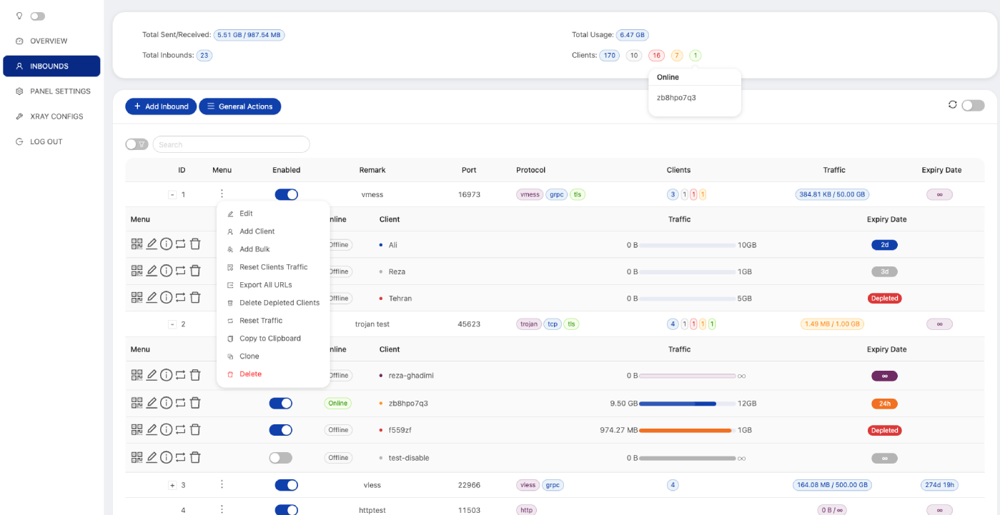
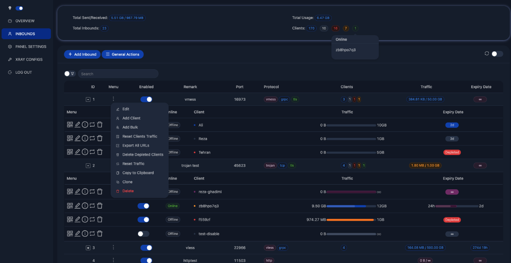

## **请注意：该项目是 alireza0/x-ui 1.8.12 的备份修复，不会更新维护，请不要向该项目提交 Issue 或 Pull Request**

---

# X-UI
**An Advanced Web Panel • Built on Xray Core**

[](https://www.gnu.org/licenses/gpl-3.0.en.html)

> **Disclaimer:** This project is only for personal learning and communication, please do not use it for illegal purposes, please do not use it in a production environment


## Install & Upgrade to Latest Version

```sh
bash <(curl -Ls https://raw.githubusercontent.com/ouyangzhaoxing/x-ui-1.8.12/master/install.sh)
```

## Preview



